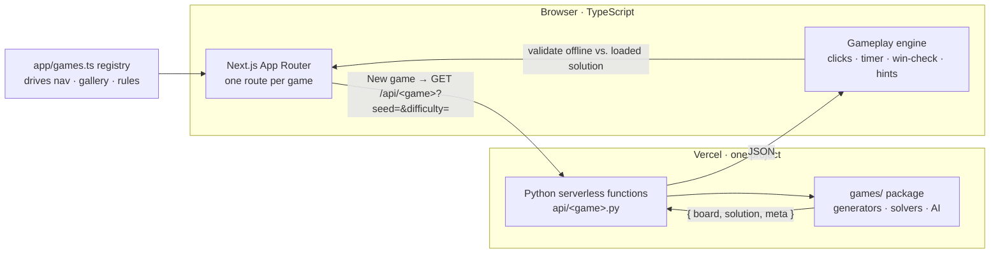

# 🎲 Playbox — Games built with Python

**Playable browser games whose boards and opponents are generated live by real Python algorithms.**

[](https://github.com/shiva-shivanibokka/Games-built-using-Python/actions/workflows/ci.yml)
[](./LICENSE)


[](https://games-built-using-python.vercel.app)

**▶️ Live: https://games-built-using-python.vercel.app**

---

## Recruiter TL;DR

- **What it is:** a single web app hosting **8 puzzle/strategy games** (Tic-Tac-Toe, Sudoku, Tango, Zip, Queens, Wend, Lights Out, Brain Teasers) — each with difficulty levels, a timer with best-times, hints, and a win animation.
- **Hardest problem solved:** every board is **generated on demand by Python running as a live serverless API**, using real algorithms (minimax, backtracking with a proven-unique solution, GF(2) linear algebra, Hamiltonian-path generation, constraint solving) — the browser only handles gameplay, so puzzles are infinite and never repeat.
- **Grounded, not hand-wavy:** **641 automated tests**, GitHub Actions CI on every push, deployed on Vercel's free tier with **no database** (seeded generators replace one).

## Overview

Most "portfolio games" are pure front-end clones. This project's goal was the opposite: put **real algorithmic Python at the centre** of something genuinely playable and polished, and ship it end-to-end.

The design splits cleanly:

- **Python does the thinking** — generates puzzles, solves them, proves uniqueness, and computes perfect opponents. It runs as free **Vercel Python serverless functions**, and the same modules are covered by a `pytest` suite.
- **The browser does the playing** — clicks, dragging, timers, hints, and win detection run instantly in client-side TypeScript.
- **They meet over JSON.** Each generator returns `{ board, solution, meta }`; the browser plays against the loaded solution, so hints and validation are instant and offline. Only "new board" touches the network.

Because generation is **seeded**, the same seed reproduces the same board — which is what makes shareable/daily puzzles possible later with zero backend. There is **no database**: progress (best times, streaks) lives in `localStorage`.

## Features

- **8 games**, each its own Python module + serverless endpoint + route + tests:
  - **Tic-Tac-Toe** — minimax AI with Easy / Medium / Hard strength (Hard is unbeatable).
  - **Sudoku** — unique-solution generator, difficulty by clue count, number pad, conflict highlighting.
  - **Tango** — 6×6 sun/moon logic with `=` / `×` edge constraints and a unique solution.
  - **Zip** — draw one continuous line through every cell in order (Hamiltonian path), rendered as a filling trail.
  - **Queens** — one crown per row/column/colour-region, none touching; carve-based unique-solution generator.
  - **Wend** — trace hidden words that tile the grid (variable size and word count).
  - **Lights Out** — turn every light off; solvability guaranteed and solved via GF(2) linear algebra.
  - **Brain Teasers** — multiple-choice number sequences, cryptarithms, deductive logic, and odd-one-out.
- **Difficulty selector** (Easy / Medium / Hard) on every game.
- **Timer + best time**, saved per game and per difficulty.
- **Hints** in every game (e.g. the optimal move, one correct cell, or the next step).
- **Win celebration** — a colour-matched glow pulses around a solved game.
- **"How to play"** panel on every game, driven from a single registry.
- **Infinite, unique boards** — seeded, generated fresh each play.

## Architecture

One Vercel project, two runtimes: Next.js serves the site; Python functions generate boards. The same Python modules power the API, the tests, and (potentially) notebooks — one source of truth.



**Why this shape:**

- **Live serverless generation over a static puzzle bank** — a bank is finite and memorizable; on-demand generation is infinite and, being seeded, still supports reproducible/daily boards.
- **Gameplay in the browser, not the server** — a network round-trip per click would feel laggy. Shipping the solution with the board keeps hints/validation instant and works offline.
- **No database (yet)** — seeded generation covers daily/shareable boards, and `localStorage` covers personal bests, keeping the whole thing on Vercel's free tier.
- **A single game registry** (`app/games.ts`) is the source of truth for the nav, the gallery, and each game's "how to play" text, so adding a game never means editing shared UI.

## Tech Stack

| Layer | Choice | Notes |
|---|---|---|
| Frontend | **Next.js 16 (App Router), React 19, TypeScript 5** | One route per game; static-prerendered shell. |
| Styling | **Tailwind CSS v4** | Per-game signature gradients; theme-aware. |
| Backend | **Python 3.12 serverless functions** (Vercel) | Pure standard library — no third-party runtime deps, so cold starts stay small. |
| Shared Python | `games/` package | Generators, solvers, AI — imported by the API and the tests. |
| Tests | **pytest** | 641 checks across all eight games. |
| CI | **GitHub Actions** | Runs `pytest` + `next build` on every push/PR. |
| Hosting | **Vercel** (free tier) | Git integration auto-deploys `main` to production. |

## Skills Demonstrated

- **Full-stack web development** — Next.js/React front end with a Python serverless back end in one deployable project.
- **Algorithm design & implementation** — minimax, backtracking with unique-solution enforcement, **GF(2) linear algebra** (Lights Out solver), Hamiltonian-path generation, and constraint solving (cryptarithms).
- **RESTful API design** — eight stateless serverless endpoints with a consistent, versionable JSON contract and query-param validation/clamping.
- **System design & architecture** — an explicit, documented client/server split with reasoned trade-offs (live generation vs. bank; offline gameplay; no-DB via seeding).
- **CI/CD pipeline implementation** — a GitHub Actions pipeline that gates on tests + build, then deploys to Vercel (production on `main`, preview URLs on PRs).
- **Automated testing** — a 641-case `pytest` suite that re-verifies invariants (solution validity, uniqueness, determinism), not just happy paths.
- **Cloud deployment** — Vercel (mixed Node + Python runtimes in a single project).

## Getting Started

**Prerequisites:** Node 20+ and Python 3.12.

```bash
git clone https://github.com/shiva-shivanibokka/Games-built-using-Python.git
cd Games-built-using-Python
npm install
```

**Run the Python tests:**

```bash
python -m pytest tests/ -q
```

**Front-end dev server (UI only):**

```bash
npm run dev          # http://localhost:3000
```

> ⚠️ **Note on local Python APIs:** `next dev` does **not** serve the `/api/*.py`
> functions (Next.js owns routing locally), so the boards won't generate under
> `npm run dev`. To run the full stack locally, use the Vercel CLI:
>
> ```bash
> npm i -g vercel && vercel dev
> ```
>
> In production, Vercel serves the Python functions and Next.js together — this
> is only a local-dev caveat.

## Usage

Every game exposes a serverless endpoint that returns a fresh board as JSON:

```bash
# A medium Sudoku (puzzle + its unique solution)
curl "https://games-built-using-python.vercel.app/api/sudoku?difficulty=medium&seed=42"
# → {"puzzle":"49.321.57...","solution":"498321657...","difficulty":"medium","seed":42}

# The AI's optimal Tic-Tac-Toe move for a given board (Hard = minimax)
curl "https://games-built-using-python.vercel.app/api/tic-tac-toe?board=XX-O-----&ai=O&level=hard"
# → {"move":2,"winner":null,"done":false,"board":"XXOO-----"}
```

The same logic is a plain, importable Python package:

```python
from games.tic_tac_toe import best_move
best_move(["O", "O", "", "X", "X", "", "", "", ""], ai="O")  # -> 2 (completes the win)

from games.sudoku import generate
puzzle = generate(seed=42, difficulty="hard")   # {puzzle, solution, difficulty, seed}
```

## Project Structure

```
Games-built-using-Python/
├─ api/                 # Vercel Python serverless functions (thin handlers)
│  └─ <game>.py         #   parse params → call games/<game> → return JSON
├─ games/               # Shared Python: the actual algorithms
│  └─ <game>/           #   generator.py · solver.py / ai.py · __init__.py
├─ app/                 # Next.js App Router (TypeScript)
│  ├─ games.ts          #   registry: one entry per game (drives nav, gallery, rules)
│  ├─ layout.tsx        #   shell: nav, aurora background, fonts
│  ├─ page.tsx          #   landing gallery
│  ├─ components/       #   GameShell, Scoreboard, GameControls, NavBar
│  ├─ lib/timer.ts      #   stopwatch + best-time helpers
│  └─ <game>/page.tsx   #   one interactive route per game
├─ tests/               # pytest suite (test_<game>.py)
├─ vercel.json          # bundles games/** into the Python functions
├─ requirements.txt     # (stdlib-only functions; presence enables the Python builder)
└─ .github/workflows/ci.yml
```

## Testing

```bash
python -m pytest tests/ -q     # 641 passed
```

Tests are **invariant checks**, not just smoke tests — e.g. each generator test
produces many seeded boards and asserts the solution is valid **and** unique
(where the game guarantees uniqueness), that the same seed is deterministic, and
that solvers actually solve. The Tic-Tac-Toe test exhaustively plays every game
tree to prove the Hard AI never loses.

CI (GitHub Actions) runs this suite plus `next build` (TypeScript typecheck +
compile) on every push to `main` and every pull request.

## Deployment

Deployed on **Vercel** (free tier), driven by a **GitHub Actions CI/CD pipeline**
(`.github/workflows/ci.yml`):

1. On every push to `main` and every pull request, the `pytest` suite and
   `next build` run as required checks.
2. **Gated on both passing**, the pipeline deploys via the Vercel CLI —
   **production** on `main`, a **preview URL** on pull requests.

The deploy job reads `VERCEL_ORG_ID` / `VERCEL_PROJECT_ID` from the workflow and
activates once a `VERCEL_TOKEN` repository secret is set (Settings → Secrets and
variables → Actions); until then it skips gracefully. Vercel builds the Next.js
app and the Python functions in the same project — `vercel.json` bundles the
shared `games/` package into each function.

## Roadmap / Future Work

- **Zip unique-solution guarantee** — Zip boards are always *solvable* but not yet
  provably *unique* (unlike Sudoku/Tango/Queens). Enforcing it needs an added
  path-counting solver.
- **Per-game algorithm notebooks** — a Jupyter walkthrough per game explaining the
  generator/solver, for the "how it works" story.
- **More brain-teasers & games** — 2048, Nonograms, Minesweeper.
- **Daily puzzle + shareable boards** — already unlocked by the seeded generators
  (seed = date); just needs the UI wiring.
- **Optional accounts / global leaderboards** — the only feature that would require
  a database.

## License

[MIT](./LICENSE) © 2026 Shivani Bokka
